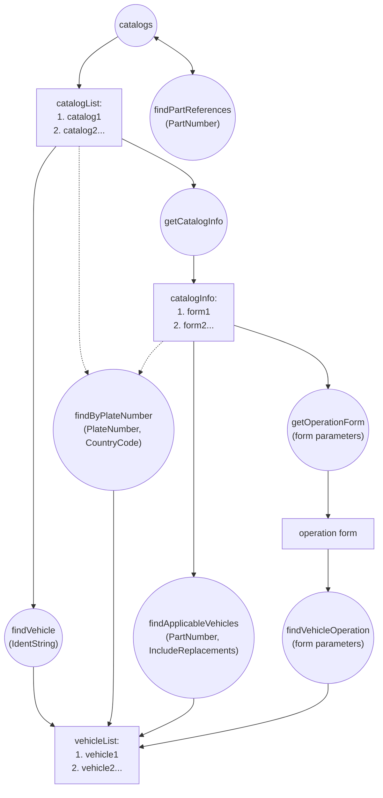
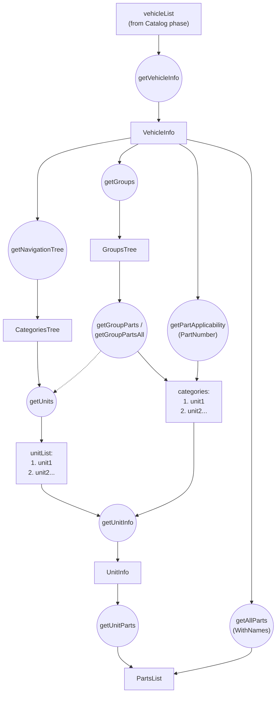
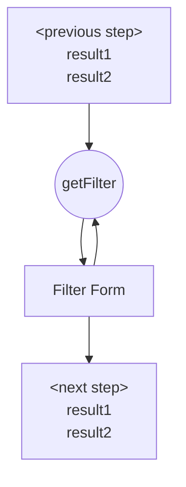

# YQ OEM REST API — Workflow Diagram

Mermaid transcription of the official process diagram from
`YQCAT_RESTAPI_DOCUMENTATION (4-5).pdf` (pages 1–2 of the source PDF). This
diagram is not present in the plain-text `YQCAT_RESTAPI_DOCUMENTATION.md`
export — it only exists as an image in the PDF, hence this file.

**Legend:** ovals = function/endpoint calls (`POST /restApi/v2/...`),
rectangles = response data structures. Dashed arrows = alternative/related
path called out in the original diagram, not a strict "produces" relation.

## Catalog phase — find a vehicle (brand not yet pinned to one vehicle)

## Vehicle phase — navigate from a chosen vehicle to its parts

## Filtration pattern (applies inside many of the calls above)

Any call that accepts `filterValues`/`currentFilterState` (e.g.
`getVehicleInfo`, `getNavigationTree`, `getUnits`) can optionally be refined
through `getFilter`, which can be called repeatedly to narrow the result
further before continuing to the next step.

## Reading the two phases together

1. **Catalog phase** ends once a single vehicle is identified — by VIN
   (`findVehicle`), plate number (`findByPlateNumber`), part number
   (`findPartReferences` → pick a catalog → `findApplicableVehicles`), or
   step-by-step wizard (`getOperationForm` → `findVehicleOperation`). All
   four roads converge on the same `vehicleList`.
2. **Vehicle phase** starts from one `vehicle` entry's `getVehicleInfo` link
   and forks into three independent ways to reach parts: by category tree
   (`getNavigationTree` → `getUnits`), by group tree (`getGroups` →
   `getGroupParts`/`getGroupPartsAll`), or directly by a known part number
   already inside this vehicle (`getPartApplicability`) — all three land on
   the same `categories`/`unitList` shape feeding `getUnitInfo`/`getUnitParts`.
   `getAllParts` is a shortcut that skips the tree entirely and returns
   every part in the vehicle in one flat `PartsList`.
